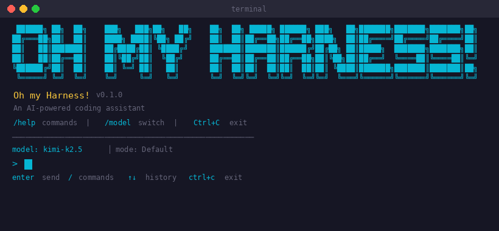
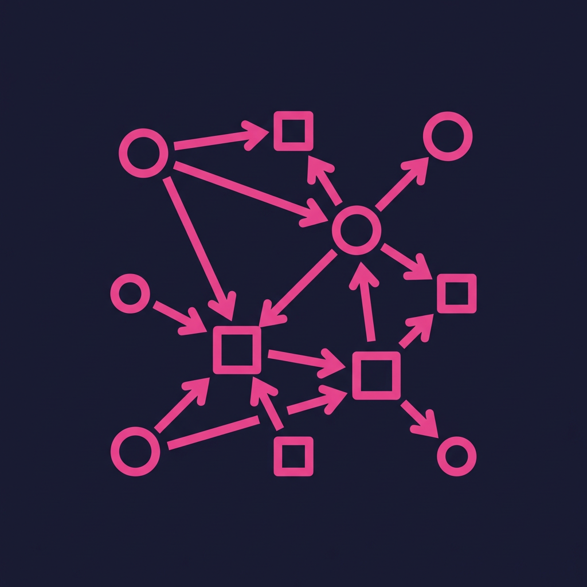
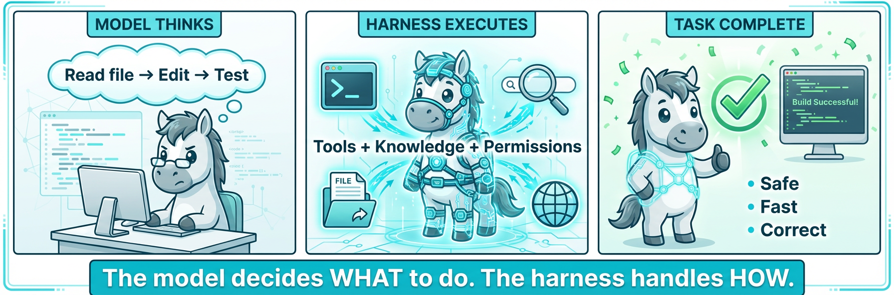

# OpenHarness

<p align="center">
  
</p>

<p align="center">
  <b>Oh my Harness! — An open-source, production-grade Agent Harness for AI coding assistants.</b>
</p>

<p align="center">
  <a href="https://pypi.org/project/openharness-ai/"></a>
  <a href="https://github.com/HKUDS/OpenHarness/blob/main/LICENSE"></a>
  
  
</p>

<p align="center">
  <a href="README.zh-CN.md">中文文档</a> &nbsp;|&nbsp;
  <a href="CHANGELOG.md">Changelog</a> &nbsp;|&nbsp;
  <a href="CONTRIBUTING.md">Contributing</a> &nbsp;|&nbsp;
  <a href="docs/SHOWCASE.md">Showcase</a>
</p>

---

<p align="center">
  
</p>

## What is OpenHarness?

OpenHarness is an open-source Python framework for building, orchestrating, and deploying AI coding agents. It provides a complete **agent harness** — the runtime infrastructure that turns a language model into a capable, tool-using, permission-aware coding assistant.

<p align="center">
  
</p>

> **Harness = Tools + Knowledge + Observation + Action + Permissions**
>
> OpenHarness provides 43+ built-in tools, a persistent memory system, file & environment awareness, an agentic execution loop, and multi-level permission control — all wired together into a coherent runtime.

---

## Highlights

<table>
<tr>
<td width="80" align="center"></td>
<td>
<b>Agent Loop Engine</b><br/>
Stream-based tool-call loop with conversation memory, auto-compact, multi-turn execution, and configurable effort levels. Supports both interactive REPL and headless print mode.
</td>
</tr>
<tr>
<td align="center"></td>
<td>
<b>43+ Built-in Tools</b><br/>
File read / write / edit, bash execution, grep, glob, web fetch & search, LSP code intelligence, Jupyter notebook editing, browser automation (Playwright), todo management, cron scheduling, and more.
</td>
</tr>
<tr>
<td align="center"></td>
<td>
<b>Multi-Agent Swarm</b><br/>
Spawn teammate agents as subprocesses with inter-agent messaging (mailbox), distributed permission synchronization, and pluggable backends. Coordinate complex tasks across a team of agents.
</td>
</tr>
<tr>
<td align="center"></td>
<td>
<b>Permissions & Sandboxing</b><br/>
Multi-level permission control (<code>default</code>, <code>plan</code>, <code>full_auto</code>) with per-tool allow/deny lists. Docker sandbox backend for containerized code execution with resource limits and network isolation.
</td>
</tr>
<tr>
<td align="center"></td>
<td>
<b>Knowledge & Memory</b><br/>
Persistent cross-session memory with YAML frontmatter entries, semantic search (multilingual), skills (Markdown-based), plugins, and MCP (Model Context Protocol) for extending tool capabilities.
</td>
</tr>
</table>

---

## Feature Overview

| Category | Details |
|---|---|
| **Multi-Provider** | Anthropic (Claude), OpenAI, GitHub Copilot, Codex CLI, Claude CLI, Gemini, MiniMax, Moonshot (Kimi), DashScope, Bedrock, Vertex, OpenRouter, Ollama, Groq, Together AI, DeepSeek, and any OpenAI-compatible endpoint |
| **MCP Protocol** | Model Context Protocol client with stdio / HTTP / WebSocket transports for extending tools via external servers |
| **Skills System** | Markdown-based skill definitions (`SKILL.md`) — install from GitHub repos or write your own; bundled skills include `commit`, `plan`, `debug`, `diagnose`, `simplify` |
| **Plugin Ecosystem** | Hooks + plugins for pre/post tool execution, custom commands, and lifecycle management |
| **Autopilot** | Repository autopilot: scan GitHub issues/PRs, priority queue, automated execution, verification, cron-based scheduling, and a static kanban dashboard |
| **Sessions** | Session persistence with `--continue` (resume last) and `--resume` (pick by ID) |
| **Web UI** | FastAPI + SQLite backend with SSE streaming, session management, skill management, and a browser interface |
| **React Terminal UI** | Modern React + TypeScript TUI with Markdown rendering, themes (`dark`, `cyberpunk`, `solarized`, `minimal`), and Vim mode |
| **Voice** | Real-time speech-to-text transcription and voice command parsing |
| **Channels** | Message-bus integrations: Telegram, Discord, Slack, Feishu (Lark) |
| **Background Tasks** | Spawn local agent or shell tasks with status tracking; built-in cron scheduler daemon |
| **Slash Commands** | Extensible `/commands` system: `/help`, `/model`, `/compact`, `/memory`, `/clear`, `/status`, and more |

---

## Quick Start

### One-command Install

```bash
curl -fsSL https://raw.githubusercontent.com/HKUDS/OpenHarness/main/scripts/install.sh | bash
```

This will automatically:
1. Check Python 3.10+ and Node.js 18+
2. Create a virtual environment at `~/.openharness-venv/`
3. Install the package with all dependencies
4. Build the React terminal frontend
5. Link `oh` / `openharness` / `ohmo` commands to `~/.local/bin/`

### Install via pip

```bash
pip install openharness-ai

# With optional extras
pip install 'openharness-ai[web]'       # FastAPI Web UI
pip install 'openharness-ai[browser]'   # Playwright browser automation
```

### Install from Source

```bash
git clone https://github.com/HKUDS/OpenHarness.git
cd OpenHarness
pip install -e '.[dev,web,browser]'

# (Optional) Build the React TUI frontend
cd frontend/terminal && npm ci && cd ../..
```

### Verify Installation

```bash
oh --version
# openharness 0.1.7
```

---

## Setup

Run the interactive setup wizard to configure your LLM provider:

```bash
oh setup
```

The wizard guides you through:
1. **Selecting a provider** — Claude API, OpenAI, Copilot, Kimi, GLM, MiniMax, OpenRouter, or custom endpoint
2. **Authenticating** — Enter API key or run device-code flow
3. **Choosing a model** — Pick from available aliases or enter a custom model ID

### Manual Authentication

```bash
oh auth login                      # Interactive provider picker
oh auth login anthropic            # Anthropic API key
oh auth login openai               # OpenAI API key
oh auth login gemini               # Google Gemini API key
oh auth login minimax              # MiniMax API key
oh auth login moonshot             # Moonshot (Kimi) API key
oh auth copilot-login              # GitHub Copilot device flow
oh auth codex-login                # Bind Codex CLI subscription
oh auth claude-login               # Bind Claude CLI subscription
oh auth status                     # Show all auth sources & profiles
```

---

## Usage

### Interactive Mode (REPL)

```bash
oh                                 # Start interactive session
oh -m opus                         # Use a specific model alias
oh -m sonnet                       # Use Claude Sonnet
oh --theme cyberpunk               # Apply a TUI theme
oh --effort high                   # Set effort level
oh --verbose                       # Enable verbose output
oh -c                              # Continue the last session in current dir
oh -r                              # Resume a session (interactive picker)
oh -r <session-id>                 # Resume by session ID
oh -n "refactor auth"              # Name this session
```

### Non-interactive (Print) Mode

Ideal for CI/CD pipelines, shell scripts, and automation:

```bash
oh -p "Explain this codebase"
oh -p "Summarize the purpose of this repo" --output-format json
oh -p "List files that define the permission system" --output-format stream-json
oh -p "Fix the bug in auth.py" --max-turns 10 --permission-mode full_auto
```

### Web UI

```bash
oh web                             # Launch at http://127.0.0.1:7860
oh web --port 8080 --host 0.0.0.0  # Custom host and port
oh web --reload                    # Dev mode with auto-reload
```

### Advanced CLI Flags

```bash
oh --system-prompt "You are a security auditor"    # Override system prompt
oh --append-system-prompt "Always write tests"     # Append to system prompt
oh --base-url https://my-proxy.com/v1              # Custom API endpoint
oh --api-key sk-...                                # Override API key
oh --api-format openai                             # Use OpenAI-compatible format
oh --settings settings.json                        # Load settings from file
oh --mcp-config mcp.json                           # Load MCP server configs
oh --bare                                          # Minimal mode: skip hooks, plugins, MCP
oh --debug                                         # Enable debug logging
oh --allowed-tools bash file_read                  # Allow only specific tools
oh --disallowed-tools web_fetch                    # Deny specific tools
```

---

## Provider Management

```bash
oh provider list                   # List all provider profiles
oh provider use copilot            # Switch active provider
oh provider use claude-api         # Switch to Claude API
oh auth switch openai              # Switch auth source

# Add a custom provider profile
oh provider add my-llm \
  --label "My LLM" \
  --provider openai \
  --api-format openai \
  --auth-source openai_api_key \
  --model gpt-4o \
  --base-url https://my-endpoint.com/v1

oh provider edit my-llm --model gpt-4o-mini   # Edit existing profile
oh provider remove my-llm                      # Remove a profile
```

### Supported Providers

| Provider | Auth Method | Default Model | Notes |
|---|---|---|---|
| Anthropic (Claude) | API key | `sonnet` | Default provider |
| OpenAI | API key | `gpt-4o` | GPT-4o, o1, o3, o4, etc. |
| GitHub Copilot | OAuth device flow | — | Via `oh auth copilot-login` |
| Codex CLI | External binding | `gpt-5.4` | Via `oh auth codex-login` |
| Claude CLI | External binding | `sonnet` | Via `oh auth claude-login` |
| Google Gemini | API key | `gemini-2.5-flash` | Built-in profile |
| MiniMax | API key | `MiniMax-M2.7` | Built-in profile |
| Moonshot (Kimi) | API key | `kimi-k2.5` | Anthropic-compatible |
| DashScope (Alibaba) | API key | — | OpenAI-compatible |
| AWS Bedrock | Credentials | — | Via provider profile |
| Google Vertex AI | Credentials | — | Via provider profile |
| OpenRouter | API key | — | Via custom profile |
| Ollama / Groq / Together AI / DeepSeek | API key | — | Via custom OpenAI-compatible profile |

### Environment Variables

| Variable | Description |
|---|---|
| `ANTHROPIC_API_KEY` | Anthropic API key |
| `OPENAI_API_KEY` | OpenAI API key (also used as fallback for OpenAI-format providers) |
| `GEMINI_API_KEY` | Google Gemini API key |
| `MINIMAX_API_KEY` | MiniMax API key |
| `MOONSHOT_API_KEY` | Moonshot API key |
| `DASHSCOPE_API_KEY` | DashScope API key |
| `OPENHARNESS_MODEL` | Override the default model |
| `OPENHARNESS_API_FORMAT` | Select API format (`anthropic` or `openai`) |
| `OPENHARNESS_LOG_LEVEL` | Set log level (`DEBUG`, `INFO`, `WARNING`, etc.) |

---

## Tools

OpenHarness ships with **43+ built-in tools**:

| Tool | Description |
|---|---|
| `bash` | Execute shell commands |
| `file_read` | Read file contents |
| `file_write` | Write / create files |
| `file_edit` | Surgical search-and-replace edits |
| `glob` | Find files by glob pattern |
| `grep` | Search file contents with regex (ripgrep-powered) |
| `web_fetch` | Fetch and extract content from URLs |
| `web_search` | Search the web |
| `lsp` | Language Server Protocol operations (go-to-definition, find references, etc.) |
| `notebook_edit` | Edit Jupyter notebook cells |
| `browser_navigate` | Navigate to URL (Playwright) |
| `browser_screenshot` | Capture page screenshots |
| `browser_click` | Click page elements |
| `browser_execute_js` | Execute JavaScript in browser |
| `skill` | Load and execute a skill definition |
| `todo_write` | Manage todo lists |
| `cron_create` | Create scheduled cron jobs |
| `task_create` | Spawn background tasks |
| `agent` | Spawn a sub-agent for parallel work |
| `mcp_*` | MCP server tool invocation, resource management, and auth |

---

## MCP (Model Context Protocol)

```bash
oh mcp list                        # List configured MCP servers
oh mcp add my-server '{"command": "npx", "args": ["-y", "@my/mcp-server"]}'
oh mcp remove my-server

# Load MCP configs via CLI flag
oh --mcp-config mcp-servers.json
```

Supports **stdio**, **HTTP**, and **WebSocket** transports.

---

## Skills

Skills are Markdown files (`SKILL.md`) that teach the agent specialized workflows.

```bash
oh skills list --installed               # Show installed skills
oh skills list --remote                  # Browse available remote skills
oh skills sources                        # List skill sources

# Install from GitHub
oh skills install owner/repo --skill frontend-design
oh skills install owner/repo --all       # Install all skills from a repo

# Remove
oh skills remove skill-name
```

**Bundled skills:** `commit`, `plan`, `debug`, `diagnose`, `simplify`, `tavily_search`

Custom skills go in `~/.openharness/skills/your-skill/SKILL.md`.

---

## Plugins

```bash
oh plugin list                     # List installed plugins
oh plugin install ./my-plugin      # Install from local path
oh plugin uninstall my-plugin      # Uninstall
```

Plugins can register hooks (pre/post tool execution), add custom slash commands, and extend the tool registry. Plugin directories: `~/.openharness/plugins/` and `.openharness/plugins/` (project-local).

---

## Autopilot

The repository autopilot automates task intake, execution, and verification:

```bash
oh autopilot status                      # Queue overview
oh autopilot scan issues                 # Scan GitHub issues
oh autopilot scan prs                    # Scan GitHub PRs
oh autopilot scan all                    # Scan all sources
oh autopilot add idea "Add caching" --body "Redis-based cache layer"
oh autopilot list                        # List all cards
oh autopilot list running                # Filter by status
oh autopilot run-next                    # Execute top-priority card
oh autopilot tick                        # Scan + auto-run if idle
oh autopilot install-cron                # Set up recurring scans
oh autopilot journal                     # View execution journal
oh autopilot context                     # Print active repo context
oh autopilot export-dashboard            # Export static kanban (GitHub Pages)
```

---

## Cron Scheduler

```bash
oh cron start                      # Start scheduler daemon
oh cron stop                       # Stop scheduler
oh cron status                     # Check state & job counts
oh cron list                       # List all jobs with schedules
oh cron toggle my-job true         # Enable / disable a job
oh cron history                    # Show execution history
oh cron logs --lines 50            # View scheduler log
```

---

## Permission Modes

| Mode | Behavior |
|---|---|
| `default` | Ask before executing potentially dangerous tools |
| `plan` | Read-only tools auto-approved; write tools require confirmation |
| `full_auto` | All tools auto-approved (use only in sandboxed environments) |

```bash
oh --permission-mode plan
oh --permission-mode full_auto
oh --dangerously-skip-permissions        # Alias for full_auto
oh --allowed-tools bash file_read        # Whitelist specific tools
oh --disallowed-tools web_fetch          # Blacklist specific tools
```

---

## Docker Sandbox

Run tool executions inside an isolated Docker container:

```yaml
# ~/.openharness/settings.yaml
sandbox:
  backend: docker
  docker:
    image: python:3.12-slim
    memory_limit: 512m
    cpu_limit: 1.0
    network: none
```

The sandbox automatically manages container lifecycle, path mapping, and prevents container escape.

---

## ohmo — Personal Agent Companion

<p align="center">
  
</p>

`ohmo` is a companion personal-agent application built on top of OpenHarness, adding personality, user profiles, and a multi-channel gateway:

```bash
ohmo                               # Start ohmo interactive session
ohmo memory list                   # List persistent memories
ohmo memory add "key fact"         # Add a memory entry
ohmo soul show                     # View personality profile (soul.md)
ohmo user show                     # View user profile (user.md)
ohmo gateway start                 # Launch multi-channel gateway
```

Workspace structure: `~/.ohmo/` with `soul.md`, `user.md`, `memory/`, and `state/` directories.

---

## Architecture

<p align="center">
  
</p>

---

## Project Structure

```
OpenHarness/
├── src/openharness/              # Core Python package
│   ├── api/                      #   LLM provider clients (Anthropic, OpenAI, Copilot, Codex)
│   ├── auth/                     #   Authentication & provider credential management
│   ├── autopilot/                #   Repository autopilot (scan, queue, execute, verify)
│   ├── bridge/                   #   Distributed agent session coordination
│   ├── channels/                 #   Chat platform integrations (Telegram, Discord, Slack, Feishu)
│   ├── commands/                 #   Slash command registry
│   ├── config/                   #   Settings, paths, and YAML config management
│   ├── coordinator/              #   Multi-agent team definitions & registry
│   ├── engine/                   #   Core agent loop (QueryEngine, stream events)
│   ├── hooks/                    #   Pre/post tool execution hooks
│   ├── keybindings/              #   TUI key binding definitions
│   ├── mcp/                      #   Model Context Protocol client (stdio, HTTP, WS)
│   ├── memory/                   #   Persistent cross-session memory system
│   ├── output_styles/            #   Output format styles (default, codex)
│   ├── permissions/              #   Permission checker & decision engine
│   ├── personalization/          #   User preference extraction
│   ├── plugins/                  #   Plugin loader, installer, lifecycle
│   ├── prompts/                  #   System prompt builder & env discovery
│   ├── sandbox/                  #   Docker sandbox integration
│   ├── services/                 #   Cron scheduler, session storage, skill fetcher
│   ├── skills/                   #   Markdown-based skill registry & loader
│   ├── state/                    #   Application state management
│   ├── swarm/                    #   Multi-agent swarm (mailbox, backends, permissions)
│   ├── tasks/                    #   Background task manager (agent & shell tasks)
│   ├── themes/                   #   TUI themes (dark, cyberpunk, solarized, minimal)
│   ├── tools/                    #   43+ built-in tools & tool registry
│   ├── ui/                       #   Terminal UI (REPL, print mode, React TUI host)
│   ├── utils/                    #   Utility helpers
│   ├── vim/                      #   Vim mode support
│   ├── voice/                    #   Speech-to-text & voice commands
│   ├── web/                      #   FastAPI Web UI (server, routes, SQLite, static)
│   └── cli.py                    #   CLI entry point (typer)
├── ohmo/                         # ohmo personal agent companion
├── frontend/terminal/            # React + TypeScript terminal UI
├── autopilot-dashboard/          # Autopilot kanban dashboard (React)
├── scripts/                      # Install & test scripts
├── tests/                        # Comprehensive test suite
├── docs/                         # Documentation & showcase
└── pyproject.toml                # Project metadata & dependencies
```

---

## Development

```bash
# Clone and setup
git clone https://github.com/HKUDS/OpenHarness.git
cd OpenHarness
uv sync --extra dev                # or: pip install -e '.[dev,web,browser]'

# Frontend (optional)
cd frontend/terminal && npm ci && cd ../..

# Run tests
uv run pytest -q

# Lint
uv run ruff check src tests scripts

# Type check
uv run mypy src/openharness

# Frontend type check
cd frontend/terminal && npx tsc --noEmit
```

### PR Expectations

- Keep PRs scoped and reviewable
- Include the problem, the change, and how you verified it
- Add or update tests when behavior changes
- Add an entry under `Unreleased` in [CHANGELOG.md](CHANGELOG.md) for user-visible changes

See [CONTRIBUTING.md](CONTRIBUTING.md) for the full guide.

---

## Showcase

### 1. Repository-aware coding assistant

```bash
oh
> Review this repo, identify the highest-risk bug, patch it, and run the relevant tests.
```

### 2. Headless automation for CI

```bash
oh -p "Summarize the purpose of this repository" --output-format json
oh -p "Find and fix type errors" --max-turns 20 --permission-mode full_auto
```

### 3. Multi-agent task coordination

```bash
oh
> Spawn a worker to audit the test suite while you inspect the CLI command registry.
```

### 4. Provider compatibility testing

Test the same workflow across different LLM backends:

```bash
oh --api-format anthropic -m sonnet -p "Explain the auth flow"
oh --api-format openai --base-url https://api.deepseek.com/v1 -p "Explain the auth flow"
```

See [docs/SHOWCASE.md](docs/SHOWCASE.md) for more examples.

---

## Configuration Reference

All configuration is stored in `~/.openharness/`:

| Path | Purpose |
|---|---|
| `settings.yaml` | Global settings (theme, model, provider, MCP servers, verbose, etc.) |
| `credentials/` | Encrypted API keys and OAuth tokens |
| `skills/` | Installed skill definitions (SKILL.md) |
| `plugins/` | Plugin manifests, hooks, and code |
| `memory/` | Persistent memory entries (Markdown with YAML frontmatter) |
| `data/` | Session snapshots and SQLite databases |
| `logs/` | Scheduler logs and execution logs |
| `agents/` | Agent definitions for team coordination |

Project-local config can be placed in `.openharness/` at the repo root.

---

## License

This project is licensed under the [MIT License](LICENSE).

---

<p align="center">
  <sub>Built with care by the <a href="https://github.com/HKUDS">HKUDS</a> team.</sub>
</p>
